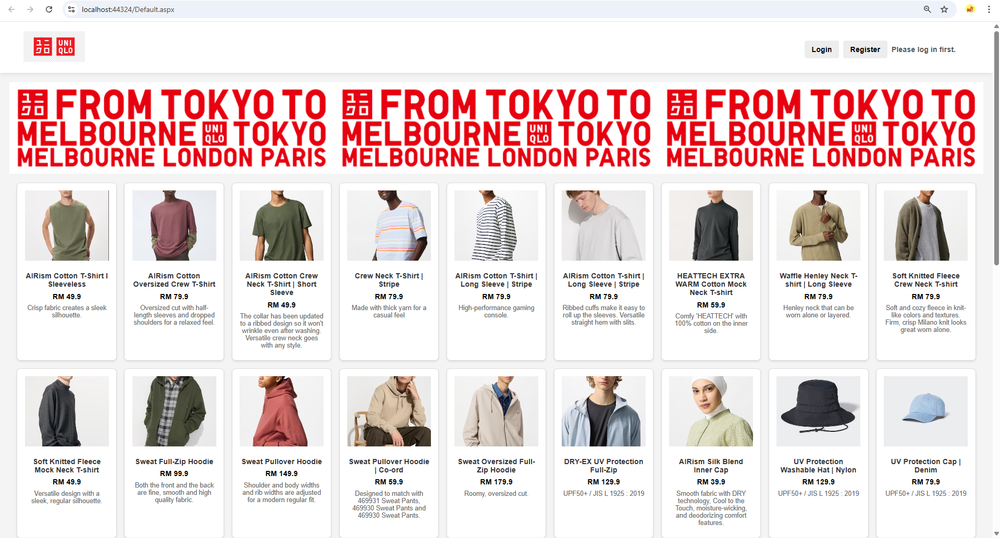
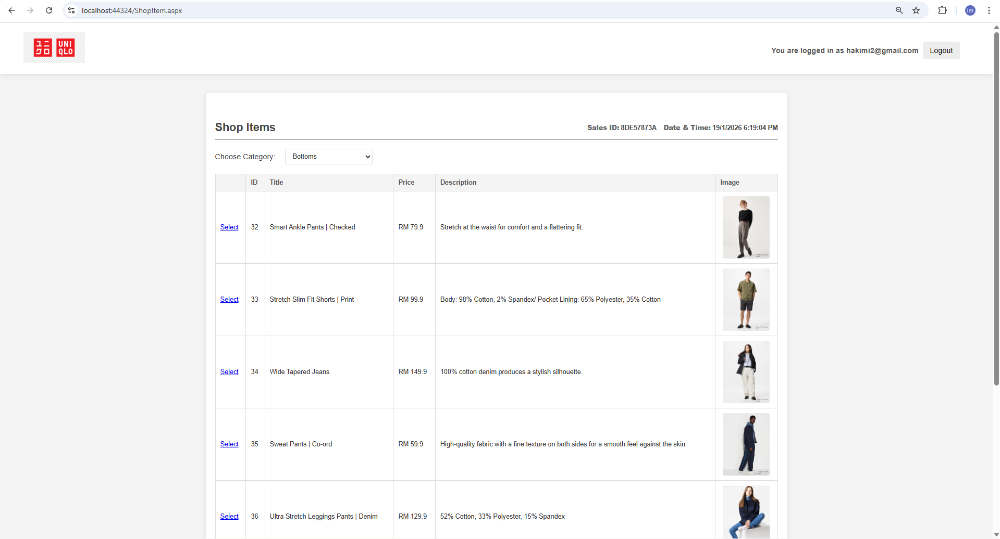
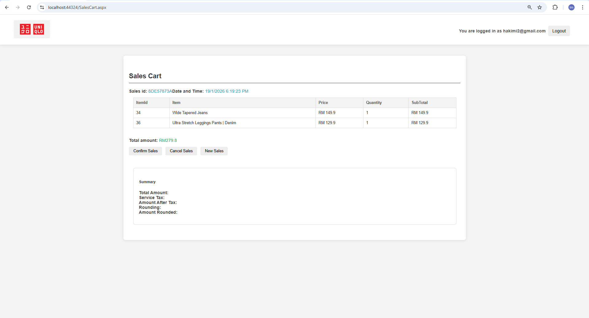
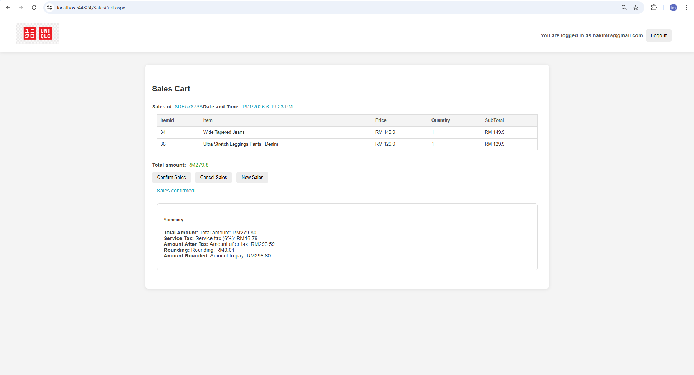
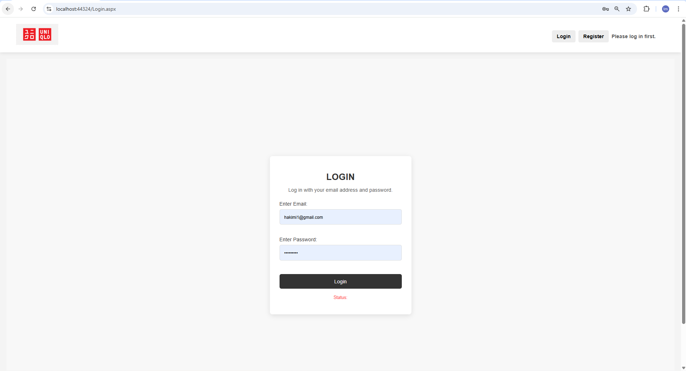
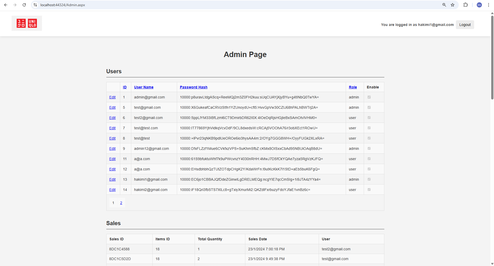

# UniQLO E-Commerce Web Application

<div align="center">

[](https://dotnet.microsoft.com/)
[](https://docs.microsoft.com/en-us/dotnet/csharp/)
[](https://dotnet.microsoft.com/download/dotnet-framework)
[](https://www.microsoft.com/en-us/sql-server/)
[](LICENSE)

A full-featured e-commerce web application built with **ASP.NET Web Forms** and **C#**, featuring user authentication, product catalog, shopping cart functionality, and administrative dashboard.

[Features](#features) • [Tech Stack](#tech-stack) • [Project Structure](#project-structure)

</div>

---

## 📋 Overview

UniQLO E-Commerce is a semester group project developed as part of **Web Application Development** course at **UniKL MIIT**. This web application demonstrates core e-commerce functionalities including user authentication, product browsing, shopping cart management, and an admin control panel for inventory and user management.

The application is built using **ASP.NET Web Forms** with a **SQL Server LocalDB** database backend, showcasing best practices in web application development including:

- Secure password hashing with PBKDF2
- Session-based user authentication
- Database-driven product catalog
- Transaction management for orders

---

## ✨ Features

### For Customers

- 🔐 **User Authentication**
  - Secure registration with email validation
  - Login with PBKDF2 password hashing
  - Session-based authentication

- 🛍️ **Shopping System**
  - Browse products categorized by type
  - View detailed product information
  - Add multiple items to shopping cart
  - Quantity validation (1-10 items per order)

- 🛒 **Shopping Cart Management**
  - View cart contents with item details
  - Calculate automatic subtotals and totals
  - 6% service tax calculation
  - Smart rounding algorithm
  - Confirm or cancel purchases

- 📱 **Responsive Design**
  - Modern, clean user interface
  - Optimized for desktop viewing
  - Consistent navigation across pages

### For Administrators

- 👥 **User Management**
  - View all registered users
  - Enable/disable user accounts
  - Edit user roles and permissions

- 📦 **Inventory Management**
  - Add, update, delete products
  - Categorize products
  - Manage product pricing and descriptions
  - Upload and manage product images

- 📊 **Sales Analytics**
  - View all completed sales transactions
  - Track customer purchases
  - Monitor order quantities and totals

---

## 🛠️ Tech Stack

| Component          | Technology              |
| ------------------ | ----------------------- |
| **Language**       | C#                      |
| **Framework**      | ASP.NET Web Forms       |
| **.NET Version**   | .NET Framework 4.7.2    |
| **Frontend**       | HTML5, CSS3, JavaScript |
| **Database**       | SQL Server LocalDB      |
| **Authentication** | PBKDF2 Password Hashing |
| **IDE**            | Visual Studio 2022      |

### Dependencies

- Microsoft.CodeDom.Providers.DotNetCompilerPlatform 2.0.1

---

## 📖 Usage

### User Workflow

1. **Register a New Account** (if not already registered)
   - Navigate to "Register" page
   - Enter valid email and password (minimum 8 characters, 1 letter + 1 number)
   - Account is created as "user" role

2. **Login**
   - Go to Login page
   - Enter email and password
   - Upon successful login, redirected to Shop page

3. **Browse & Shop**
   - Select product category from dropdown
   - Click on a product to view details
   - Enter quantity (1-10 items)
   - Click "Add to Cart"
   - View cart total amount

4. **Checkout**
   - Review items in shopping cart
   - Click "Confirm Sales" to complete purchase
   - View invoice with tax and rounding calculations
   - Current sales can be cancelled and restarted

### Admin Workflow

1. **Login as Admin**
   - Use admin credentials (requires admin role in database)
   - Automatically redirected to Admin dashboard

2. **Manage Users**
   - View all registered users
   - Edit user details and roles
   - Enable/disable accounts

3. **Manage Inventory**
   - Add new products with details and images
   - Update existing product information
   - Delete obsolete products
   - Filter products by category

4. **View Sales**
   - Monitor all completed transactions
   - Track customer purchases
   - Analyze sales data

---

## 📁 Project Structure

```
ProjectAppWeb/
├── App_Data/
│   ├── DataBase.mdf          # SQL Server database
│   └── DataBase_log.ldf      # Database log file
├── Images/                    # Product and brand images
│   ├── uniqlologo.png
│   ├── uniqlo-banner-long.png
│   └── [product images]
├── Styles/
│   ├── StyleSheet1.css       # Main stylesheet
│   └── sign-in.css           # Authentication page styles
├── UserControls/
│   └── LoginStatus.ascx      # Login status component
├── Properties/
│   └── AssemblyInfo.cs
├── Admin.aspx[.cs]           # Admin dashboard
├── Default.aspx[.cs]         # Home page with product listing
├── Login.aspx[.cs]           # User login page
├── Register.aspx[.cs]        # User registration page
├── ShopItem.aspx[.cs]        # Product browsing & cart management
├── SalesCart.aspx[.cs]       # Shopping cart review
├── User.Master[.cs]          # Master page template
├── PBKDF2Hash.cs             # Password hashing utility
├── Web.config                # Application configuration
├── ProjectAppWeb.csproj      # Project file
└── packages.config           # NuGet dependencies
```

---

## 🗄️ Database Schema

### Tables

- **UserAccount** - User registration and authentication
- **Categories** - Product categories
- **Items** - Product catalog
- **Sales** - Order/sales transactions
- **SalesItems** - Line items in sales

### Stored Procedures

- `spSalesAddItem` - Add item to shopping cart
- `spSalesGotItems` - Retrieve cart items
- `spSalesGotTotalAmount` - Calculate total
- `spSalesConfirm` - Confirm and create order
- `spSalesRemoveNotConfirm` - Cancel unconfirmed order
- `spGetSalesWithCombinedItems` - Admin sales report

---

## 🔐 Security Features

- **PBKDF2 Password Hashing** - Industry-standard password encryption with salt and iterations
- **Session-Based Authentication** - Secure user sessions with role-based access control
- **Input Validation** - Client and server-side validation for form inputs
- **SQL Parameterization** - Protection against SQL injection
- **Role-Based Access** - Different access levels for users and administrators

---

## 🎓 Learning Outcomes

This project demonstrates:

- ✅ Full-stack web application development
- ✅ ASP.NET Web Forms architecture and controls
- ✅ Database design and SQL stored procedures
- ✅ User authentication and authorization
- ✅ Session management
- ✅ CRUD operations (Create, Read, Update, Delete)
- ✅ Event-driven programming in C#
- ✅ Data binding and GridView/ListView controls
- ✅ Master pages and user controls
- ✅ CSS styling and responsive design

---

## 📸 Screenshots

### Home Page - Product Listing

Browse all available products with category filtering and detailed information.



### Product Selection & Shopping

View detailed product information and add items to your shopping cart with quantity validation.



### Shopping Cart

Review your cart contents with automatic price calculations, taxes, and checkout options.



### Sales Confirmation

View order summary with itemized details, tax calculation, rounding, and final amount to pay.



### Login & Registration

Secure user authentication with email validation and PBKDF2 password hashing.



### Admin Dashboard

Complete management interface for users, inventory, and sales analytics.



---

## 📝 Project Information

- **Course:** Web Application Development
- **Institution:** Universiti Kuala Lumpur (UniKL) - Malaysian Institute of Information Technology (MIIT)
- **Semester:** 4
- **Academic Year:** 2024
